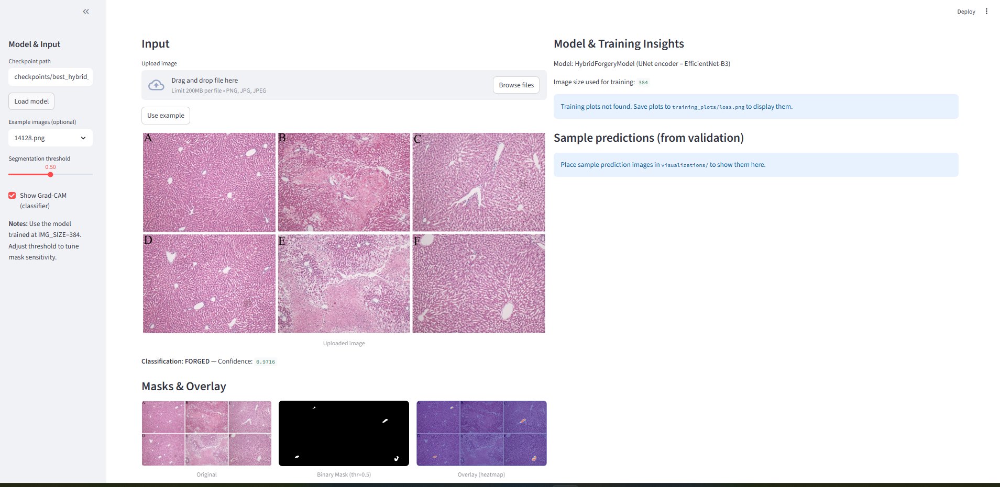
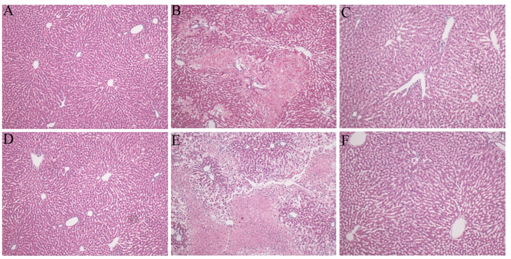
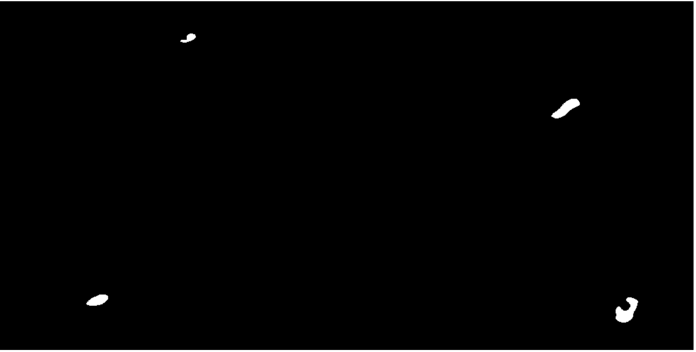
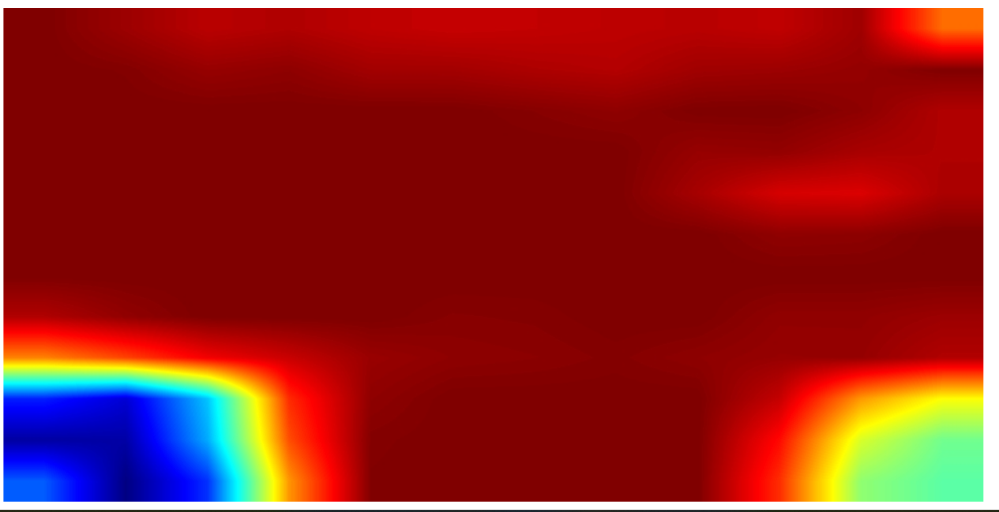

# 🚀 Image Forgery Detection

[](https://www.python.org/)
[](https://pytorch.org/)
[](LICENSE)

A **deep learning-based web app** for detecting copy-move image forgeries. Built with **PyTorch**, **Segmentation Models**, and **Streamlit**, it provides:

- Image-level classification (authentic vs forged)
- Segmentation masks for tampered regions
- Grad-CAM visualizations for interpretability
- Interactive Streamlit interface

---

## 📸 Demo

Interactive Streamlit demo:



Example predictions:

| Original Image | Predicted Mask | Grad-CAM |
|----------------|----------------|----------|
|  |  |  |

---

## Live Demo

You can try out the Scientific Copy-Move Forgery Detection app online here:

[Open Streamlit App](https://scientific-copy-move-forgery-hfc73gwmnh2pyr7jmhzu8w.streamlit.app/)

**Features:**
- Upload an image or select from example images.
- Hybrid Segmentation + Classification using UNet (EfficientNet-B3).
- Interactive segmentation threshold adjustment.
- Grad-CAM explainability for classifier predictions.
- Download the binary mask for further analysis.

---


## 🗂 Repository Structure

mageForgeryDetection/
├─ app/
│ ├─ app.py # Streamlit app
│ ├─ model.py # Model architecture
│ ├─ infer.py # Inference helper
│ ├─ examples/ # Example images / GIFs
│ └─ checkpoints/ # Model checkpoints (ignored in git)
├─ Few Data example/
│ ├─ train_images/
│ │ ├─ authentic # authentic images (.png)
│ │ └─ forged # forged images (.png)
│ └─ train_masks/ # masks (.npy)
├─ src/ # Additional scripts
├─ experiments/ # Jupyter notebooks for EDA/training
├─ requirements.txt # Python dependencies
├─ README.md # Project documentation
└─ .gitignore # Ignored files/folders


> ⚠️ **Note:** Large files (checkpoints & dataset) are excluded from GitHub.

---

## 🛠 Getting Started

### Prerequisites

- Python 3.10.9
- CUDA (optional, for GPU)
- pip

### Installation

```bash
git clone https://github.com/amitsaj94/ImageForgeryDetection.git
cd ImageForgeryDetection

# Create virtual environment
python -m venv venv

# Activate
# Windows
venv\Scripts\activate
# Linux/Mac
source venv/bin/activate

# Install dependencies
pip install -r app/requirements.txt

# Run Streamlit app
streamlit run app/app.py

```
---

## ⚡ Usage

- Open the Streamlit app in your browser.

- Upload an image.

- Get predictions:

- Authentic / Forged classification

- Segmentation mask for forged regions

- Grad-CAM visualizations (optional)

- Explore example images for reference.

## 🧠 Model Details

<details> <summary>Click to expand model architecture & training details</summary>

- Model: HybridForgeryModel – hybrid segmentation-classification network

- Input: 3×384×384 RGB

- Encoder: EfficientNet-B3 (pretrained)

- Segmentation Head: U-Net decoder (1-channel mask)

Classification Head:

- Deepest encoder features → Global Avg Pool → Dense(256) → ReLU → Dropout → Dense(1) → Sigmoid

Loss Functions:

- Segmentation: Combo (BCE + Tversky)

- Classification: BCEWithLogitsLoss

- Total Loss: seg_loss + 0.3 * cls_loss

- Optimizer: AdamW (weight decay 1e-5)
  
- Scheduler: CosineAnnealingLR (T_max=25)
  
- Mixed Precision: torch.amp with gradient clipping = 5.0
  
- Batch Size: 8
  
- Number of Parameters: ~13.25M

Data Augmentation:

- Horizontal Flip

- ShiftScaleRotate

- ElasticTransform

- GridDistortion

- Random Brightness/Contrast

- Normalization

- Best Validation Dice: 0.6056
- Checkpoint: best_hybrid_stepB_v2.pth

</details>

## 🔮 Future Improvements

- Multi-resolution training to better detect small forged regions

- Explore Transformer-based models (ViT, Swin)

- Real-time inference optimization

- Expand dataset diversity

- Advanced interpretability: Grad-CAM++, Integrated Gradients

- Streamlit app enhancements: batch image upload, video support, downloadable results

- Model compression: pruning, quantization, knowledge distillation

## 📚 References

- Cozzolino, D., et al. "Copy-move forgery detection based on patch matching." IEEE Transactions on Information Forensics and Security, 2015.

- Ronneberger, O., Fischer, P., Brox, T. "U-Net: Convolutional Networks for Biomedical Image Segmentation." MICCAI, 2015.

- Tan, M., Le, Q. "EfficientNet: Rethinking Model Scaling for CNNs." ICML, 2019.

- Segmentation Models PyTorch: GitHub

- Albumentations: Documentation

- Selvaraju, R.R., et al. "Grad-CAM: Visual Explanations from Deep Networks via Gradient-based Localization." ICCV, 2017.

# 📄 License

- Code: MIT License – free to use, modify, and distribute.

- Dataset: Kaggle competition Recod.ai/LUC - Scientific Image Forgery Detection. Check dataset terms for usage restrictions (e.g., non-commercial use).

- Model Checkpoints: Not included; train locally using instructions above.
